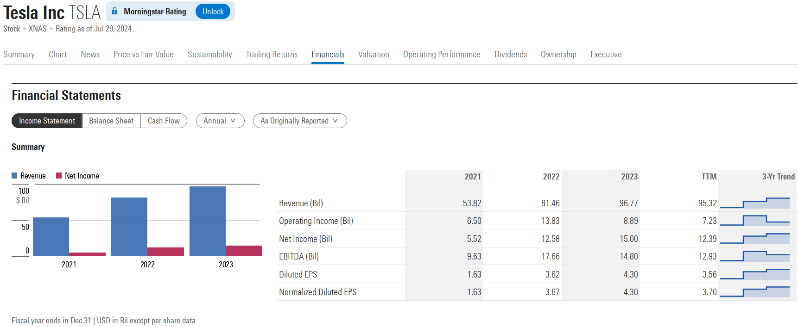
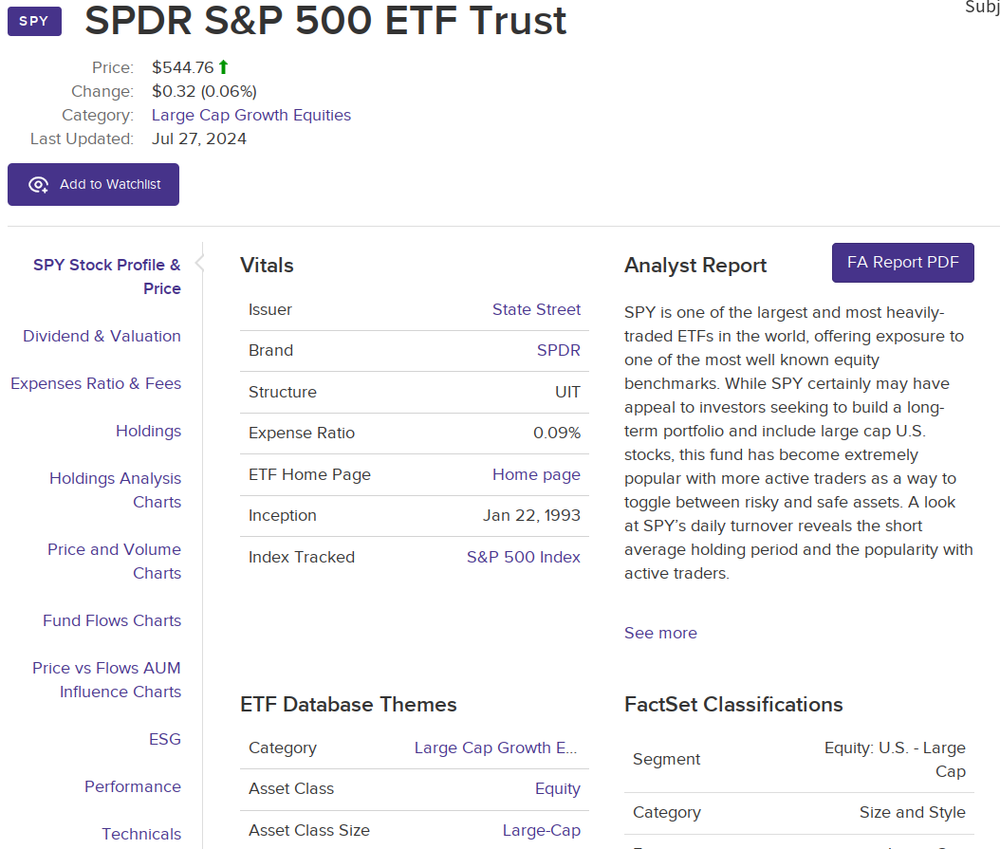
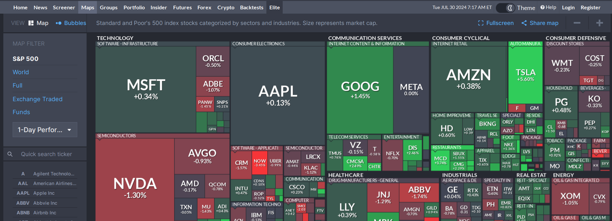
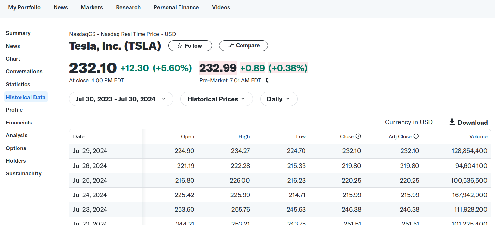
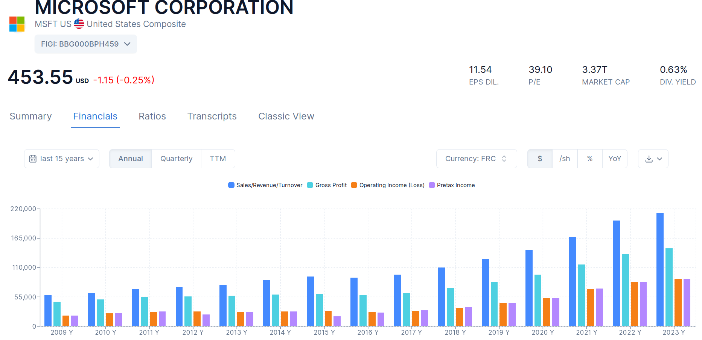
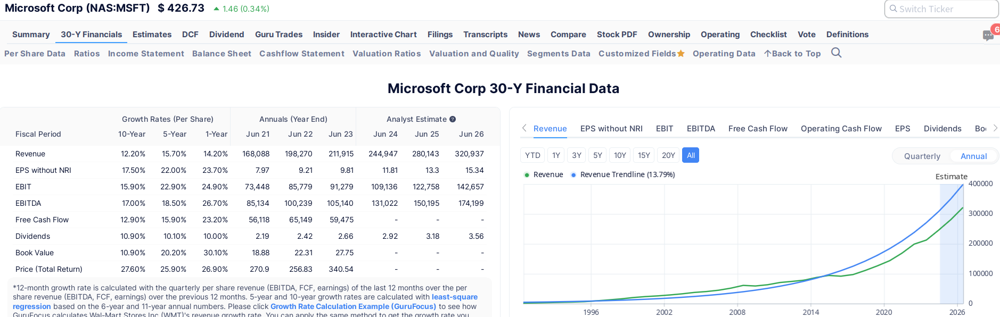
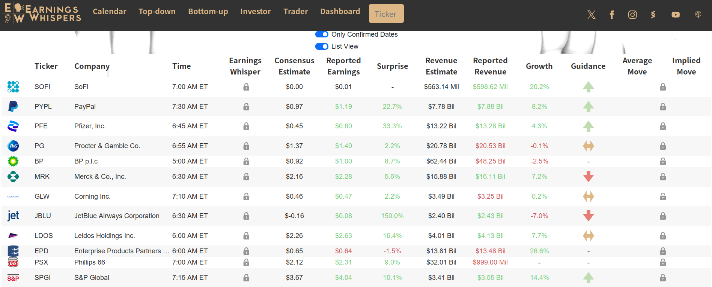
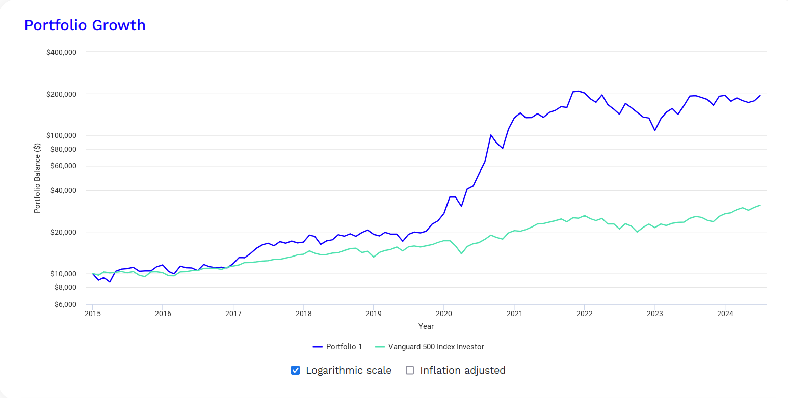


一些常用的美股网站介绍


工欲善其事，必先利其器，投资也是一样，好的工具能节省大量时间。  

A股确实不知道有啥好用的，但美股，工具性的网站非常多，作为一个工具多的差生，在此大致整理一下入门常用的网站。  

~~APP爱好党退散~~

## 信息资讯
这类网站可以方便的查询到股票的基础信息，做初步的了解和筛选  

### 启明星
我在写这篇的时候才搜到，它家居然有个备案了的中国网站，自称[晨星咨询](https://www.morningstar.cn)  
居然是真网站，不是钓鱼，但我还是喜欢叫它启明星，毕竟中国那网站四舍五入等于不能用  

[https://www.morningstar.com](https://www.morningstar.com/)
在正常的官网上，可以方便的看到各家公司的基本数据和近年的财报，以及估值情况等等  

  

还能查到一些市场数据，它当然还有许多板块比如ETF，但我基本不用

### VettaFi
我如果要看ETF会到[https://etfdb.com](https://etfdb.com)，有收费版本，但免费版基本够用  

可以找到各种ETF的信息，它还有一些可以免费用的筛选工具，方便找到想要的ETF

顺便提一句，美股作为世界上最大的股票市场，里面真的啥都有，不单有美国的公司，还有世界各地的公司；不单能投资股票，还能投资债券；不单能做多一个市场，还能相应的做空；不单能做房地产，还能投资加密货币……  

ETFDB还有对比工具，用于同类的ETF比较  

如果主要投美股ETF的话，这网站挺有用的

## Finviz
如果要选择美股而不是ETF的话，无论如何都离不开finviz

[https://finviz.com](https://finviz.com)

它能让人一次看清美股各行业的表现，也能看清全球市场的主要的股票涨跌情况

还有screener筛选器，能帮助快速找出想要的股票

### Spacstrac
还有很多细分领域的网站，比如21年时很火的SPAC,就有专门做这部分咨询的，现在它家改名了

[https://www.listingtrack.io](https://www.listingtrack.io/)  

还想研究SPAC的可以试试，SAPC也不是完全没机会，几个明星代理人的SPAC还是很贵  

总之，要有善于发现工具就会有好用的工具

## 看盘画图
技术面是个重要的方向，但并不是所有网站都能提供完整的数据和指标。  
而数据这么贵，就是券商自带的功能都不是不够用就是要收费，还免费能用的就显得很难能可贵。  

### Tradingview
如果要看详细图标时，就要用到tradingview了，这是个非常好用的看图的软件，数据和功能都非常全面  

[https://www.tradingview.com](https://www.tradingview.com/)
官网有中文，推荐用网页

免费版近来功能一砍再砍，但也勉强够用，如果学习一下pine脚本语言还能白嫖一些付费功能  

Tradingview不仅能看美股的盘，还能看外汇、加密和债券，有点太全了  

### moomoo
而看盘如果一定要客户端才够友好，那么就moomoo吧  

它不像Tradingview一样可以对接别的券商，它本身就是个券商，所幸客户端做的不错，中文友好  

[https://www.moomoo.com](https://www.moomoo.com/hans/)

## 数据报表
历史数据和财务指标对于一家公司来说就是基本面，无论如何炒股都离不开这些数据

### 雅虎财经
是不是印象中雅虎都已经凉了？其实不然，它盘子在日韩还有一些，所以还能给大家提供免费的数据  

[https://finance.yahoo.com](https://finance.yahoo.com/)

它有其它财经工具拥有的正常功能，也不难用，勉强还能替代上面的两种用作画图工具，但我最喜欢的是它的**历史数据**  

提供如此详细的个股历史数据，还能免费下载的地方并不多，何况它其它功能做的也确实不错  

### roic.ai
筛选了股票，看了股票的走势，当然要细致的分析它的财务状况，于是就需要这个并不是ai的ai网站

[https://www.roic.ai](https://www.roic.ai)  

免费提供个股的30年的财务指标和数据，它主要靠卖API盈利，所以免费的查询对于没有编程需求的投资者来说就非常友好

### Gurufocus
类似的网站还有Gurufocus，它的财务指标和**计算公式**都会列出来，非常清晰明了

[https://www.gurufocus.com](https://www.gurufocus.com) 

但它收费，还是按国家收费，并不便宜，所以大多数时候它都只是补充或学习的地方

## 财报日历
就是一些追踪公司财报的网站
## Earning Swhispers
美股的财报至关重要，所以盯住财报日也至关重要，那这个网站基本就可以pin在那里当日历  

[https://www.earningswhispers.com](https://www.earningswhispers.com) 

它可以查到美股公司的财报日，可以看到盘前/盘后公布财报的公司数量，以及市场对公司公布财报的预期

类似的网站还有[https://stockrow.com](https://stockrow.com/)就不单独列了

## 回测工具
回测在交易中的帮助很大，做量化的会自己写回测工具，但也有免费可以拿来用的  

### Portfolio Visualizer
这就是个用于回测的网站，功能有点多，因此用起来略有门槛  

[https://www.portfoliovisualizer.com](https://www.portfoliovisualizer.com/)

它把不同资产的历史数据可视化，让人清晰地看出不同资产在历史上走势的差异，可以让人直观的感受不同资产在历史上回报率和风险的关系  

注意：它的数据维度是月，要更细致的数据要别的工具

## 消息获取
股票对消息获取的实时性没有外汇强，却非常重要，而这方面内容就看个人信息获取能力了。  

如果还没有，那上面的那些资讯网站都可以，而且雅虎还算权威。  

国内也有金十等等轮播的网站，用的时候要慎重，基本都可以买消息。  

此外，就是社交平台了，telegram有不少群组和频道，可以讨论消息；[reddit](https://reddit.com)更是主导过当年散户大战华尔街的GME事件；国内的QQ微信也不是不能用，国内炒美股的体量并不小，唯独注意别听人的跟单就好。总之，不排斥消息，但要有自己的判断就好。  

## AI助手
无论做什么都需要与时俱进，生成式AI已经普及了两年了，用做学习还是不错的，一些基础问题它可以讲的很详细，别离奇到听GPT的炒个股就好。

免费的POE和perplexity都挺好用的，后者纯粹是名字太长，被埋没了  
[https://poe.com](https://poe.com)
[https://www.perplexity.ai](https://www.perplexity.ai)

付费的也有，比如：

还有A股逗着玩的：
[https://stockai.trade](https://stockai.trade)

个人觉得玩一下算了，分析下财报还能用，真指望AI交易，现阶段普通人能做的靠谱的机器交易还是量化。  

此外，上面的网站大多是英文的，也许有语言障碍，但现阶段基本不存在了，[沉浸式翻译](https://immersivetranslate.substack.com/about)可以消除绝大部分文字性的障碍，包括youtube字幕。~~非要用APP？那您自求多福。~~

## End
暂时想不起来了，还有些工具觉得不是普遍通用的，也就没往上列，再有合适的再补充吧。  

工具永远是辅助人的，人才是驾驭工具的主宰，所以工具可以帮人做决策，真正的决策需要人做出，工具现阶段还是替代不了人的，至少在交易上是这样。工具就是工具，选择合适的工具，永远不迷信于工具，借助工具获取最棒的收益！