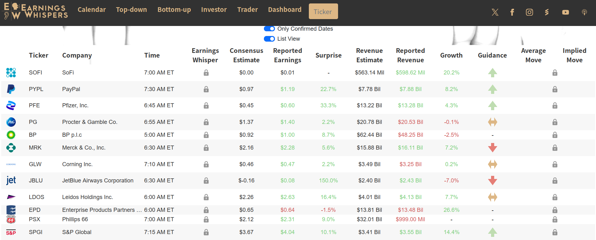


一些常用的美股网站介绍


工欲善其事，必先利其器，投资也是一样，好的工具能节省大量时间。  

A股确实不知道有啥好用的，但美股，工具性的网站非常多，作为一个工具多的差生，在此大致整理一下入门常用的网站。  

## 启明星
我在写这篇的时候才搜到，它家居然有个备案了的中国网站，自称[晨星咨询](https://www.morningstar.cn)  
居然是真网站，不是钓鱼，但我还是喜欢叫它启明星，毕竟中国那网站四舍五入等于不能用  

[https://www.morningstar.com/](https://www.morningstar.com/)
在正常的官网上，可以方便的看到各家公司的基本数据和近年的财报，以及估值情况等等  

  

还能查到一些市场数据，它当然还有许多板块比如ETF，但我基本不用

## ETFDB
我如果要看ETF会到[ETFDB](https://etfdb.com)，免费版基本够用  

可以找到各种ETF的信息，它还有一些可以免费用的筛选工具，方便找到想要的ETF

顺便提一句，美股作为世界上最大的股票市场，里面真的啥都有，不单有美国的公司，还有世界各地的公司；不单能投资股票，还能投资债券；不单能做多一个市场，还能相应的做空；不单能做房地产，还能投资加密货币……  

ETFDB还有对比工具，用于同类的ETF比较  

如果主要投美股ETF的话，这网站挺有用的

## Tradingview
如果要看详细图标时，就要用到tradingview了，这是个非常好用的看图的软件，数据和功能都非常全面

[https://www.tradingview.com/](https://www.tradingview.com/)
官网有中文，推荐用网页

免费版近来功能一砍再砍，但也勉强够用，如果学习一下pine脚本语言还能白嫖一些付费功能  

Tradingview不仅能看美股的盘，还能看外汇、加密和债券，有点太全了  

## moomoo
而看盘如果一定要客户端才够友好，那么就moomoo吧  

它不像Tradingview一样可以对接别的券商，它本身就是个券商，所幸客户端做的不错，中文友好  

[https://www.moomoo.com](https://www.moomoo.com/hans/)

## 雅虎财经
是不是印象中雅虎都已经凉了？其实不然，它盘子在日韩还有一些，所以还能给大家提供免费的数据  

[https://finance.yahoo.com/](https://finance.yahoo.com/)

它有其它财经工具拥有的正常功能，也不难用，但我最喜欢的是它的历史数据  

提供如此详细的个股历史数据，还能免费下载的地方并不多，何况它其它功能做的也确实不错  

## finviz
如果要筛选股票的话，无论如何都离不开finviz

[https://finviz.com](https://finviz.com)

它能让人一次看清美股各行业的表现，也能看清全球市场的主要的股票涨跌情况

还有screener筛选器，能帮助快速找出想要的股票

## roic.ai
筛选了股票，看了股票的走势，当然要细致的分析它的财务状况，于是就需要这个并不是ai的ai网站

[https://www.roic.ai](https://www.roic.ai)  

它免费提供个股的30年的财务指标，它主要靠卖API盈利，所以免费的查询对于只有基本需求的投资者来说就非常友好

## gurufocus
类似的网站还有gurufocus，它的财务指标和计算公式都会列出来，非常清晰明了

[https://www.gurufocus.com](https://www.gurufocus.com) 

但它收费，还是按国家收费，并不便宜，所以大多数时候它都只是补充或学习的地方

## earning swhispers
美股的财报至关重要，所以盯住财报日也至关重要，那这个网站基本就可以pin在那里当日历  

[https://www.earningswhispers.com](https://www.earningswhispers.com) 

它可以查到美股公司的财报日，可以看到盘前/盘后公布财报的公司数量，以及市场对公司公布财报的预期

类似的网站还有[https://stockrow.com/](https://stockrow.com/)就不单独列了

## Portfolio Visualizer
之前提到过回测，这就是个用于回测的网站，门槛有点高

[https://www.portfoliovisualizer.com/](https://www.portfoliovisualizer.com/)

它把不同资产的历史数据可视化，让人清晰地看出不同资产在历史上走势的差异，可以让人直观的感受不同资产在历史上回报率和风险的关系

注意：它的数据维度是月，要更细致的数据要别的工具

