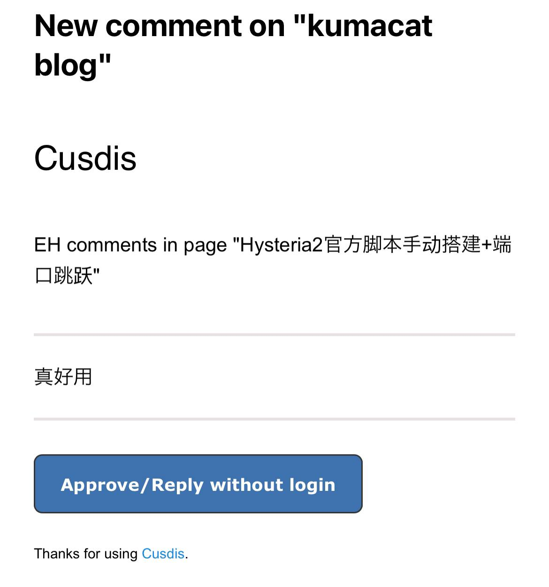
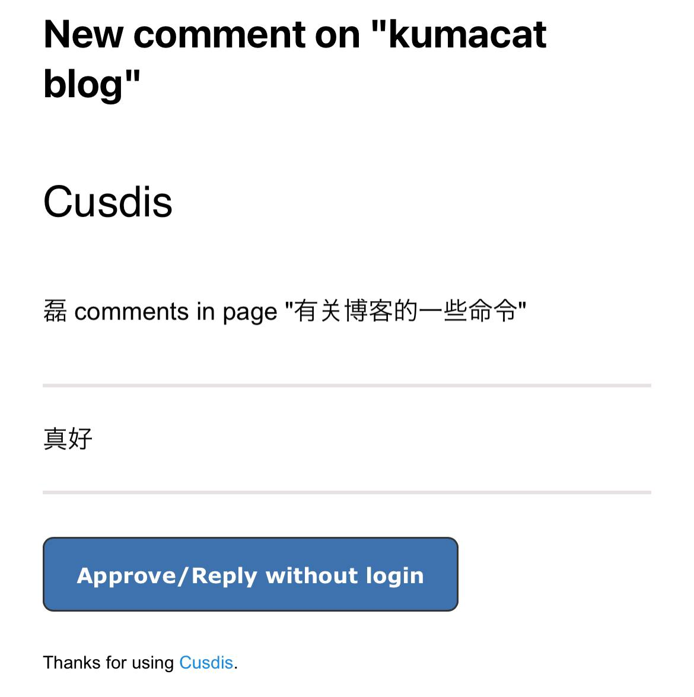


在我看来，这是一件挺欢乐的事情


起因是我收到邮件有两条评论，欣喜之余有点懵——我并没有写过这些题目，也没打算写  


  
  


我等了几天，确认 [cusdis](https://cusdis.com/) 没出问题。那最可能的情况是，有人复制了我的配置，忘了改 ID，至少评论的 ID 没改。 

作为一个采用 [CC BY-SA 4.0 ](https://creativecommons.org/licenses/by-sa/4.0/deed.en) 协议的写作者，我不反对借鉴，但请不要借鉴的这么潦草，给人平添些许哭笑不得。  

不管怎样，无论是事件本身，还是被抄了配置这事，都挺让我欢乐的。前者好像是抄作业把名字都抄了，想想就好笑。后者至少说明自己在做的，并不完全是给AI创造语料。  

总之，希望他已经发现问题并改正了吧。  

**Addition：**  
这欢乐的事情背后，有一点可悲——本站收到的第一条评论，来自其它网站  
~~这样想想更可笑了~~ 😂😂😂